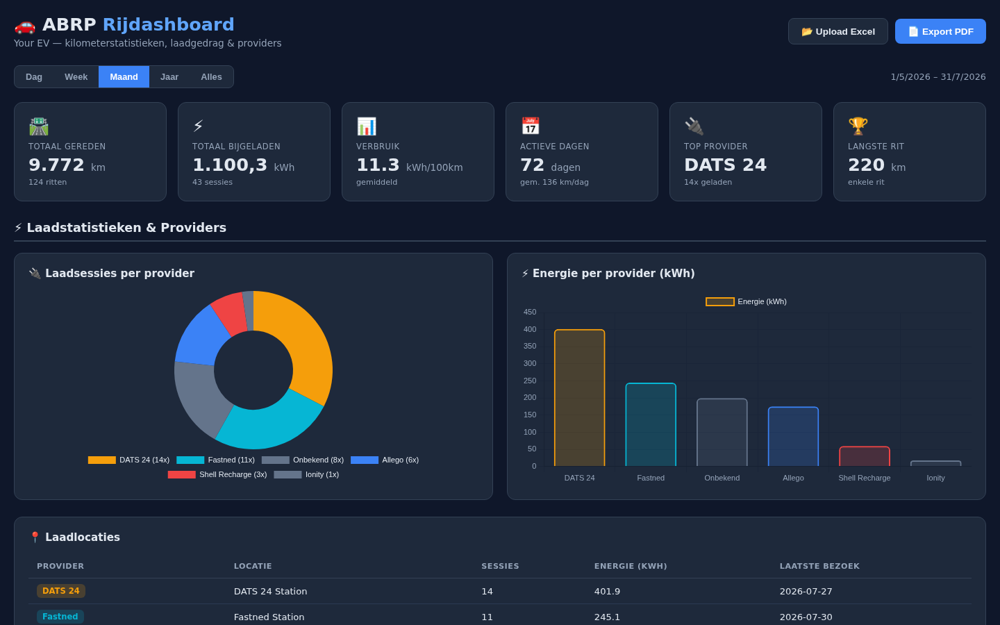
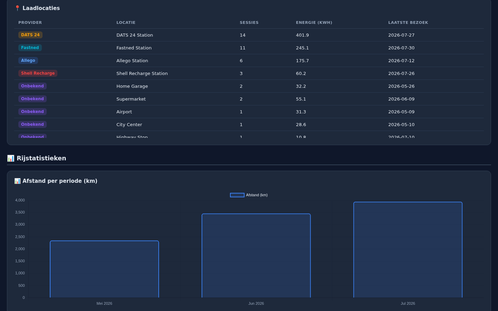
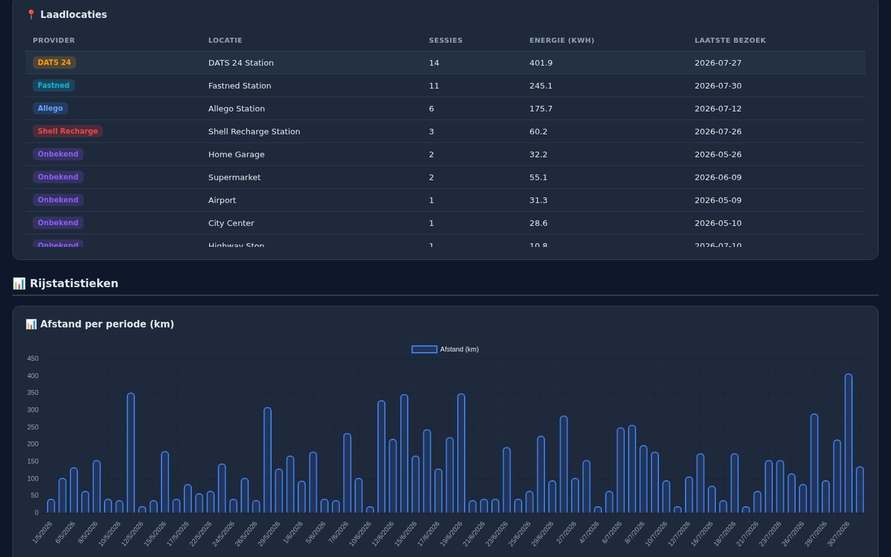
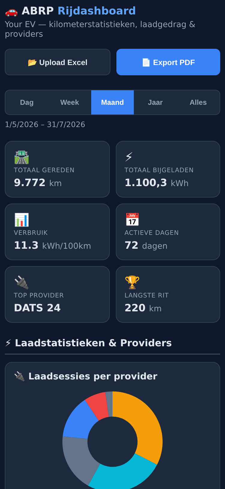
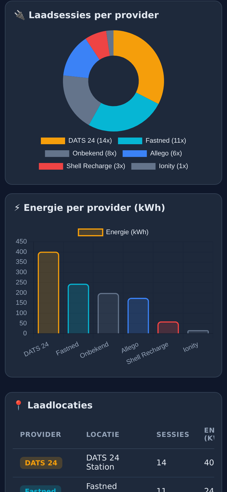
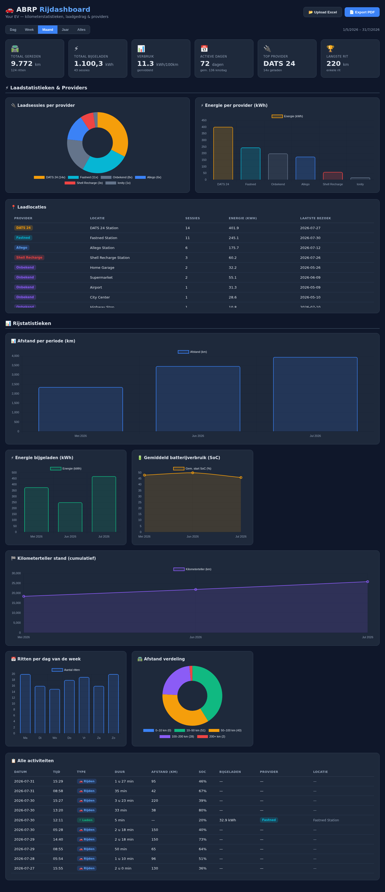

# 🚗 ABRP EV Dashboard

> A beautiful, self-contained dashboard for visualizing **ABRP** (A Better Routeplanner) Excel exports — track distance driven, charging sessions, battery SoC, and charger provider breakdowns.


---

## ✨ Features

### 📊 Interactive Visualizations
- **6 KPI Cards** — total distance, energy charged, consumption (kWh/100km), active days, top charging provider, longest trip
- **Distance Chart** — bar chart per day / week / month / year
- **Energy Charged** — bar chart of kWh per period
- **Battery SoC** — line chart of average state-of-charge over time
- **Odometer Tracking** — cumulative kilometer stand
- **Trip Distribution** — doughnut chart of distance buckets (0–10km, 10–50km, etc.)
- **Weekday Activity** — rides per day of the week

### ⚡ Charging Analytics
- **Provider Breakdown** — doughnut chart of charging sessions per provider (DATS 24, Fastned, Allego, Shell Recharge, Ionity, etc.)
- **Energy per Provider** — bar chart of kWh charged per provider
- **Charge Locations Table** — all charging locations with session count, energy, and last visit date

### 🔀 Flexible Time Filters
Switch between views with one click:

| Filter | Granularity |
|--------|------------|
| 📅 **Day** | Individual driving days |
| 📆 **Week** | ISO week numbers |
| 📊 **Month** | Monthly aggregation (default) |
| 🗓️ **Year** | Yearly totals |
| 🌐 **All** | Everything combined |

### 🎨 Provider Color Coding
Each charging provider gets a consistent color throughout the dashboard:

| Provider | Color | Hex |
|----------|-------|-----|
| 🟠 DATS 24 | Orange | `#f59e0b` |
| 🔵 Fastned | Cyan | `#06b6d4` |
| 🔷 Allego | Blue | `#3b82f6` |
| 🔴 Shell Recharge | Red | `#ef4444` |
| 🟣 T-Line / Other | Purple | `#8b5cf6` |
| 🟢 PluginCompany | Green | `#10b981` |

### 📱 Fully Responsive
- **Mobile-first design** — works great on phones, tablets, and desktops
- **KPI cards** reflow from 6 columns (desktop) → 2 columns (mobile)
- **Charts** stack vertically on small screens
- **Tables** stay fully accessible with touch-scrolling — no data is ever hidden
- **Touch-friendly** buttons (44px min) and filters
- **No data is lost** at any screen size — everything scales or scrolls

### 📂 Upload Your Own Data
Click **"Upload Excel"** to load your own ABRP exports. The dashboard automatically:
- Parses `.xlsx` files with Dutch or English ABRP column headers
- Converts miles → kilometers (× 1.609344)
- Detects charger providers from location names and GPS coordinates
- Merges and deduplicates records across multiple files
- Updates all charts and KPIs instantly

### 📄 PDF Export
Click **"Export PDF"** to save the entire dashboard (KPIs + charts + tables) as a multi-page PDF report.

---

## 🖼️ Screenshots

### Dashboard Overview — KPIs & Provider Section


### Charts Section — Distance, Energy, SoC, Odometer


### Day Filter View — Granular Daily Data


### Mobile View — Top (KPIs & Provider Charts)


### Mobile View — Charts Section


### Full Dashboard


---

## 🚀 Quick Start

### Option 1: Just open the file (easiest)
```bash
# Download or clone this repo, then:
open index.html        # macOS
xdg-open index.html    # Linux
start index.html       # Windows
```

That's it. The dashboard loads with demo data and all charts render instantly. No server, no dependencies, no build step.

### Option 2: Local server (optional)
```bash
python3 -m http.server 8000
# Open http://localhost:8000
```

---

## 📥 Using Your Own ABRP Data

1. Open the [ABRP web app](https://abetterrouteplanner.com)
2. Go to **Activities** → select a date range → **Export to Excel**
3. Open this dashboard and click **"Upload Excel"**
4. Select one or more `.xlsx` files — they'll be merged automatically

### Supported Column Format
The parser expects the standard ABRP export layout (row 3 = headers):

| Column | Description |
|--------|-------------|
| Activiteit / Activity | "Rijd" (Drive) or "Laad op" (Charge) |
| Starttijd | Start timestamp (M/D/Y H:MM) |
| Afstand [mi] | Distance in miles (auto-converted to km) |
| Energie bijgeladen [kWh] | Energy charged |
| Start/Eind SoC | Battery state of charge (0–1) |
| Kilometerteller [mi] | Odometer in miles (auto-converted to km) |

---

## 🛠️ Tech Stack

| Tool | Purpose |
|------|---------|
| [Chart.js 4](https://chartjs.org) | Interactive charts (bar, line, doughnut) |
| [SheetJS (xlsx)](https://sheetjs.com) | In-browser Excel parsing |
| [html2canvas](https://html2canvas.hertzen.com) | DOM → canvas for PDF export |
| [jsPDF](https://parall.ax/products/jspdf) | PDF generation |
| **Vanilla HTML/CSS/JS** | No frameworks, no build tools |

---

## 📁 Project Structure

```
abrp-dashboard/
├── index.html              # The entire dashboard (self-contained)
├── screenshots/            # README screenshots
│   ├── dashboard-overview.png
│   ├── dashboard-charts.png
│   ├── dashboard-day-filter.png
│   ├── dashboard-full.png
│   ├── dashboard-table.png
│   ├── mobile-top.png
│   └── mobile-charts.png
├── sample-data/            # Example ABRP export format
│   └── sample-export.xlsx  # (add your own here)
├── .gitignore
└── README.md
```

---

## 🔒 Privacy

- **100% client-side** — no data ever leaves your browser
- **No tracking, no analytics, no cookies**
- The demo data embedded in `index.html` is randomly generated and contains no real-world information
- Your uploaded Excel files are processed entirely in-browser and never sent anywhere

---

## 📄 License

MIT License — feel free to use, modify, and distribute.
